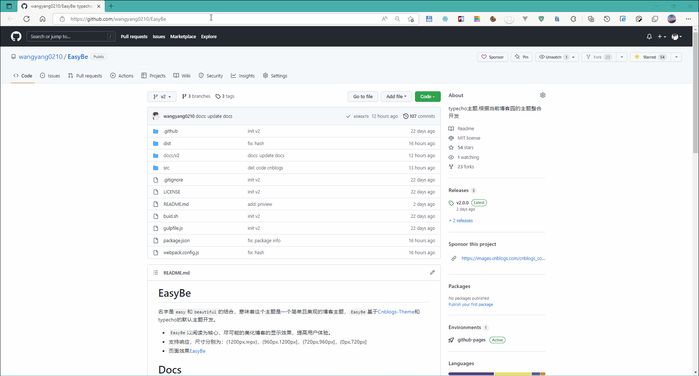
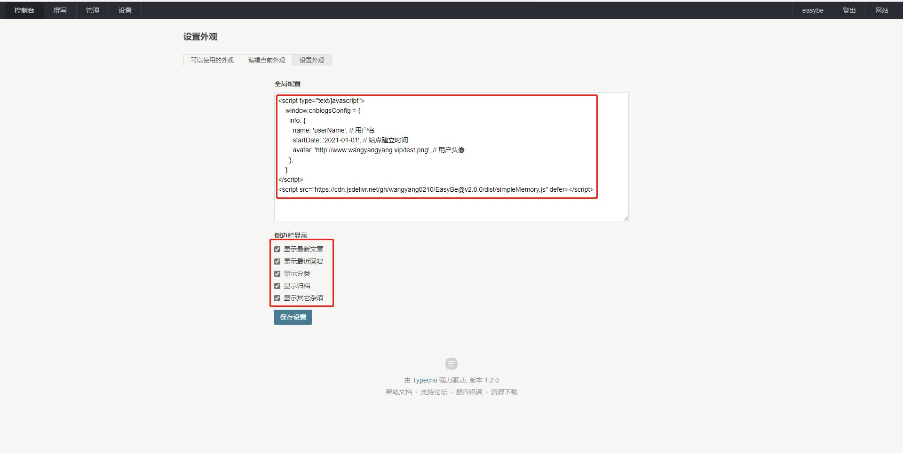

# 安装配置

!> 本文为v2版本的安装配置教程，请核对使用版本！


## 获取需要使用的版本
进入主题仓库：[GitHub](https://github.com/wangyang0210/EasyBe)

> 选择最新版本将`dist`目录上传到`typecho`的主题目录下




## 博客设置

```html
<script type="text/javascript">
    window.cnblogsConfig = {
      info: {
        name: 'userName', // 用户名
        startDate: '2021-01-01', // 站点建立时间
        avatar: 'http://xxxx.png', // 用户头像
      },
    }
</script>
<script src="https://cdn.jsdelivr.net/gh/wangyang0210/EasyBe@v2.0.0/dist/simple-memory.js" defer></script>
```



详细配置参考相关[文档](https://wangyang0210.github.io/EasyBe/v2/#/Docs/Customization/config) 。


--------

> CDN`jsdelivr` 的URL, 详细规则参考[官方网站](https://www.jsdelivr.com/) <br />

!> 版本 >= 2.1.2 支持npm包CDN加速

> CDN`unpkg`的URL, 详细规则参考[官方网站](https://www.unpkg.com/)
